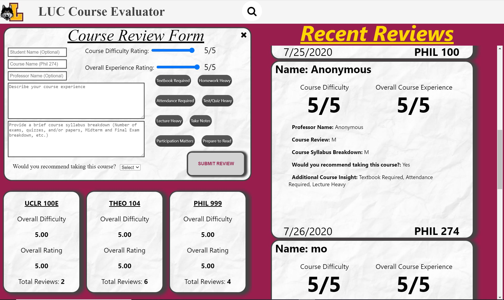

# LUC Course Evaluation Web-App

## About
This project was created for the student of Loyola University Chicago for them to read student written reviews about course provided at loyola. Students can use this as a resource to find classes that they believe they can succeed most in. 

Students provide extensive experience about past classes so future students can use their review to their benefit. 

## Languages/Tools/Services Used
This Web-app was created used React(JS Framework) and HTML/CSS. NoSQL was used to access and use Firebase's Realtime Database.

Firebase hosting, Google's cloud hosting platform, was used to host the website for free. Firebase's NoSQL realtime database was also used to store, retrieve and display student reviews.

CSS Media Queries were done to ensure the best possible experience across all device dimensions. :) (No one is left out!)

## Creators
Creator: Mohammed Patel & Kevin Guillaume

2nd year Computer Science & Software Engineering Students at Loyola University Chicago

Feel free to contact us @Mopatel1214@gmail.com for any questions, comments, or concerns. :)

